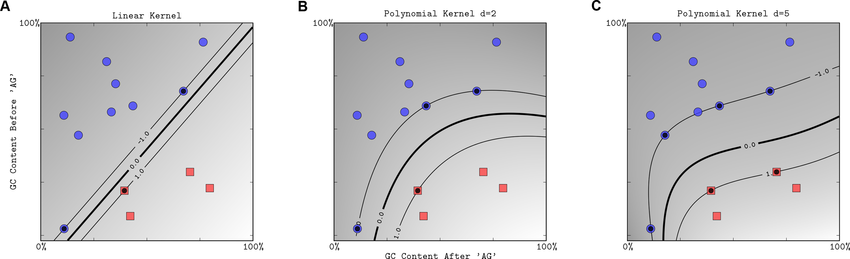
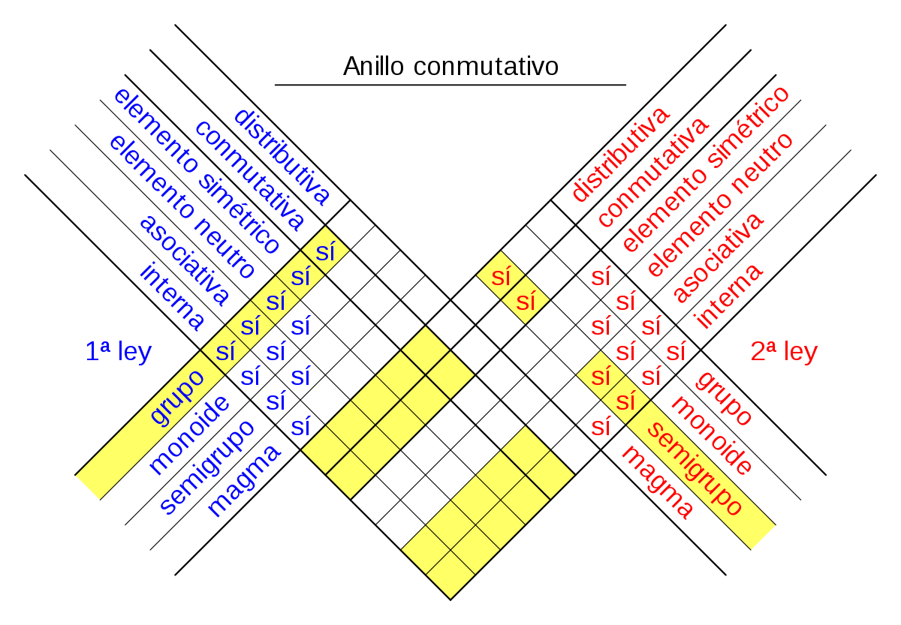
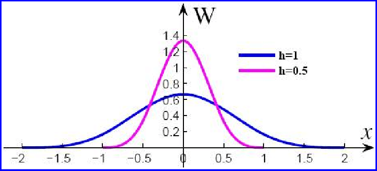
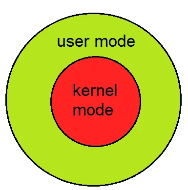

Existen varios tipos de kernel en el ámbito de la inteligencia artificial y el aprendizaje automático, cada uno con sus propias características y usos específicos. 

Algunos ejemplos comunes incluyen:

## Kernel lineal:

Es usado para clasificar datos linealmente separables. Proyecta los datos en un espacio de características más alto, donde se vuelven linealmente separables. Es el kernel más sencillo y rápido.

 

## Kernel polinómial: 
Clasifica datos que no son linealmente separables. Funciona aumentando la dimensión de los datos mediante la adición de características polinómicas, lo que permite que los datos sean separados de manera no lineal.

 
 

## Kernel radial: 
clasifica datos no linealmente separables. Mide la similitud entre los puntos de datos utilizando una medida de distancia basada en la distancia radial. Es muy útil para datos con estructura de anillo.

 
## Kernel de base de splines:
Clasifica datos no linealmente separables. Funciona midiendo la similitud entre los puntos de datos utilizando una medida basada en splines. Es muy útil para datos con estructura curva.

  

estos modos de operacion en el sistema operativo pueden confrontarse y en ese caso el User y Kernel mode se puede decir que:

El modo de usuario, también conocido como "User mode" es el modo en el que el sistema operativo ejecuta aplicaciones y programas de usuario las aplicaciones tienen acceso limitado a los recursos del sistema, como la memoria y los dispositivos de entrada/salida. Esto ayuda a proteger el sistema de posibles fallos o errores en las aplicaciones, ya que las aplicaciones no pueden acceder directamente a los recursos del sistema.

El modo de núcleo, también conocido como "Kernel mode" es el modo en el que el sistema operativo ejecuta el núcleo o el sistema operativo en sí. En este modo, el sistema operativo tiene acceso completo a todos los recursos del sistema, incluyendo la memoria y los dispositivos de entrada/salida. 

 

| Característica | User mode | Kernel mode |
| --- | --- | --- |
| Acceso a recursos | Limitado | Completo |
| Nivel de privilegios | Bajo | Alto |
| Protección del sistema | Sí | No |
| Ejecución de aplicaciones | Sí | No |
| Manejo de interrupciones | No | Sí |
| Control de procesos | No | Sí |
| Acceso a memoria | Limitado | Completo |
| Acceso a dispositivos de entrada/salida | Limitado | Completo |

  

Entonces puedo decir que el modo de usuario es utilizado para las aplicaciones y programas de usuario, mientras que el modo de núcleo es utilizado para el sistema operativo en sí. El sistema operativo cambia entre estos dos modos de operación según sea necesario para garantizar la seguridad y el rendimiento del sistema.

Esta siguiente imagen es como se ve el sistema Operativo:

