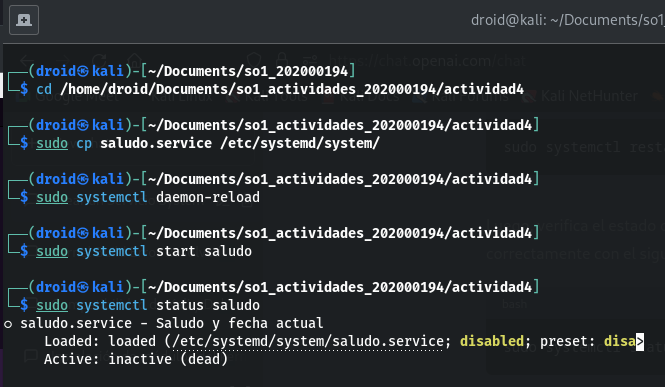

# Actividad 4
### Enunciado: 
Crear un systemd unit de tipo servicio para ejecutar un script que imprima un saludo y la fecha actual.

## Explicación del proceso

### 1. Creo un script en el directorio ./actividad4/ llamado saludo.sh con el siguiente contenido:

```bash
#!/bin/bash
echo "Hola como estan :D, Hoy tenemos: $(date)"
```
y damos permisos de ejecucion
    
```bash
chmod +x /home/droid/Desktop/saludo.sh
```
### 2. Creo un archivo de configuración para el servicio en el directorio ./actividad4/ llamado saludo.service con el siguiente contenido:

```bash
[Unit]
Description=Saludo y fecha actual
[Service]
Type=simple
ExecStart=/home/droid/Documents/so1_actividades_202000194/actividad4/saludo.sh
[Install]
WantedBy=multi-user.target
```

### 3. Copio el archivo saludo.service en el directorio /etc/systemd/system/ para que el servicio sea reconocido por el sistema.

```bash
sudo cp saludo.service /etc/systemd/system/
```
### 4. Actualizo el sistema de unidades
    
    ```bash
    sudo systemctl daemon-reload
    ```
### 5. Inicio el servicio

    ```bash
    sudo systemctl start saludo
    ```

### Revisar estado:
    
```bash
sudo systemctl status saludo
```
### Detener servicio:
    
```bash
sudo systemctl stop saludo
```
### Anexo

